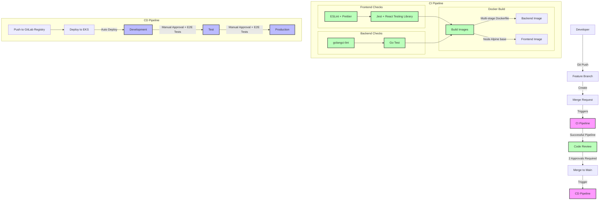

# DevOps Pipeline Documentation

## Pipeline Overview
This DevOps pipeline is designed for a Go backend and React frontend application, utilizing GitLab CI/CD and deploying to EKS across three environments.

## Key Components

### Development Flow
1. Developers work on feature branches
2. Create Merge Requests (requires 1 approval)
3. Automated CI pipeline triggers

### CI Pipeline

#### Frontend (React)
- **Linting & Formatting**: 
  - ESLint with `eslint-config-airbnb` preset
  - Prettier for consistent code formatting
  - Key plugins:
    - `eslint-plugin-react`
    - `eslint-plugin-react-hooks`
    - `eslint-plugin-import`
    - `eslint-plugin-jsx-a11y`
- **Testing**:
  - Jest as the test runner
  - React Testing Library for component testing
  - Coverage threshold: 80%
  - Test types:
    - Unit tests
    - Component tests
    - Integration tests

#### Backend (Go)
- **Linting**:
  - golangci-lint with the following linters enabled:
    - `gofmt` - Standard Go formatting
    - `golint` - Google's Go style guide
    - `govet` - Correctness checks
    - `errcheck` - Error handling checks
    - `staticcheck` - Static analysis
- **Testing**:
  - Standard Go testing framework (`go test`)
  - `testify` for assertions and mocking
  - Coverage threshold: 80%
  - Test types:
    - Unit tests
    - Integration tests

### Docker Build Process
- **Frontend**:
  - Base image: `node:alpine`
  - Multi-stage build:
    1. Build stage with node modules
    2. Production stage with nginx
  - Output: Optimized production build
- **Backend**:
  - Multi-stage Dockerfile:
    1. Build stage with Go toolchain
    2. Production stage with minimal Alpine
  - CGO disabled for smaller images
  - Distroless base image for security

### CD Pipeline
- **Container Registry**: GitLab Container Registry
- **Deployment Process**:
  1. **Dev Environment**:
     - Automatic deployment on merge to main
     - Namespace: `dev`
     - Resource limits enforced
  2. **Test Environment**:
     - Manual approval required
     - E2E tests with Cypress
     - Namespace: `test`
     - Production-like configuration
  3. **Production Environment**:
     - Manual approval required
     - Full E2E test suite
     - Namespace: `prod`
     - Blue/Green deployment strategy

## Best Practices Implemented
- Branch protection rules
  - Minimum 2 approvals
  - Pipeline must pass
  - Branch must be up to date
- Pre-commit hooks for local linting
- Automated testing and linting
- Container-based deployments
- Environment segregation
- Manual approval gates for production
- Resource quotas per namespace
- Automated rollback on failed deployments

## Configuration Files
Key configuration files that need to be set up:
- `.eslintrc.js` - ESLint configuration
- `.prettierrc` - Prettier configuration
- `.golangci.yml` - Go linter configuration
- `jest.config.js` - Jest configuration
- `Dockerfile.frontend` - Frontend Docker build
- `Dockerfile.backend` - Backend Docker build
- `.gitlab-ci.yml` - Pipeline configuration

Would you like me to provide the specific configuration for any of these files? 